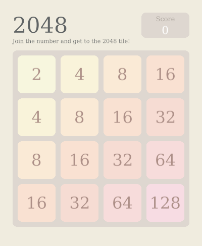

# 2048


A simple 2048 game implemented using [ggez](https://ggez.rs/).

## How To Play
Download compiled [binary](2048.zip), then extract it.
```sh
$ unzip 2048.zip
```

Simply run the binary.
```sh
$ ./simple-2048
```

## Build From Source
Make sure you have [rust](https://www.rust-lang.org/) 1.3.4 installed on your system.

Clone this repository
```sh
$ git clone https://github.com/alvinmatias69/simple-2048.git
$ cd simple-2048
```

Compile the project using release configuration
```sh
$ cargo build --release
```

Copy project resources to target directory (unfortunately this method can't be automated yet)
```sh
$ cp resources/*.* target/release/resources
```

Execute the binary
```sh
$ ./target/release/simple-2048
```

## Keybinding List
* Start a new game: <kbd>ctrl</kbd> + <kbd>n</kbd>
* Navigate Up: <kbd>w</kbd> / <kbd>k</kbd> / <kbd>&#8593;</kbd>
* Navigate Down: <kbd>s</kbd> / <kbd>j</kbd> / <kbd>&#8595;</kbd>
* Navigate Left: <kbd>a</kbd> / <kbd>h</kbd> / <kbd>&#8592;</kbd>
* Navigate Right: <kbd>d</kbd> / <kbd>l</kbd> / <kbd>&#8594;</kbd>
* Exit: <kbd>ctrl</kbd> + <kbd>q</kbd>
